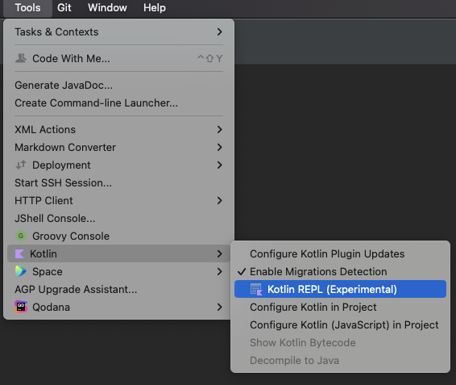
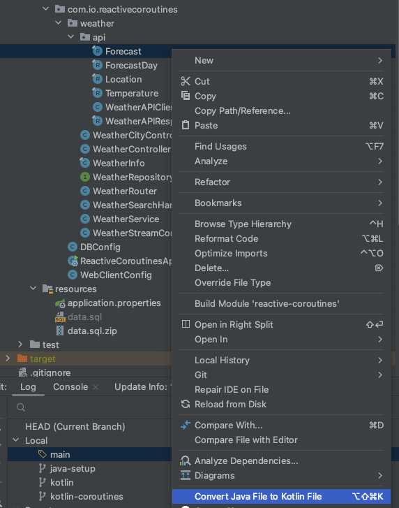

## Java reactive to Kotlin reactive

1. unzip resource file `data.sql.zip`
2. use the VM flag `-XX:+AllowRedefinitionToAddDeleteMethods`
3. set property to false the second time the application runs: `com.io.reload-db-data=false`

## HTTP script
The project contains the file `scripts/Weather-info-requests.http` that you can use to make api calls directly from your IDE

## Migration to Kotlin
As a first step, we would like to migrate the project to kotlin. The project is already configured for kotlin but the files are all java.

### Kotlin syntax help
As some of you are not familiar with kotlin, here are a few tips to help you with the syntax:

- The primitive types and their boxed versions do not exist: `int` and `Integer` become -> `Int` in Kotlin
- The types all exist in 2 variants: `nullable` and `non-nullable` so the java `String` becomes -> `String` and `String?`
- every `nullable` variable has to be accessed safely using `?.` instead of `.`: for example: `a.b?.c?.d` -> a is not nullable, but everything after is.
- you can use `?:` to conditionally access the right part when the left part is `null`. You can use (but shouldn't) `!!` to assert something as not nullable (`a!!.b` will throw NPE at Runtime if a is null)
- Functions and types are written differently: `Mono<ServerResponse> foo(Bar bar) {}` will become -> `fun foo(bar: Bar): Mono<ServerResponse> {}`
- the variables can be assigned with `val` (constant reference) or `var` (mutable reference), you should only use `var` if you can't use `val`
- the lambdas are written differently: `(a, b) -> {}` will be written `{ a, b -> }` in kotlin, if you don't provide a name for the parameter, the default `it` becomes available
- lambda parameters: in kotlin, if the only parameter is a lambda, then you omit the parenthesis in the function call: `collection.filter({ item -> item })` will be written `collection.filter { it }`
- You can chain instructions, without variables with the widely used functions `apply`, `also`, `run` and `let`. For example: `listOf(1,3).map { it += 1 }.let { setOf(it) }.also { log.debug(it) }` will return a `Set` and also log its content
- The default collections and data structures available are not mutable, if you want their mutable version, you need to request it: `listOf(1,3)` is not mutable, `mutableListOf(1,3)` is mutable.
- What you would write as a java record should be a kotlin data class: `data class A(val a: String?, val b: Int)` (be aware of the `val` in the parameter)
- The kotlin class and its file don't need to have the same name, similarly you can have as many classes as you want per file.
- instead of using static values, you can define `object` which are singletons, and usually used as `companion object` for a class to have its static methods.

You can find the REPL if you want to try some kotlin code:

### IDE auto migration
You can use the IDE functionality to get a direct code translation java to kotlin.
While the code migration works, you need to re-arrange it to make it more human-readable.

